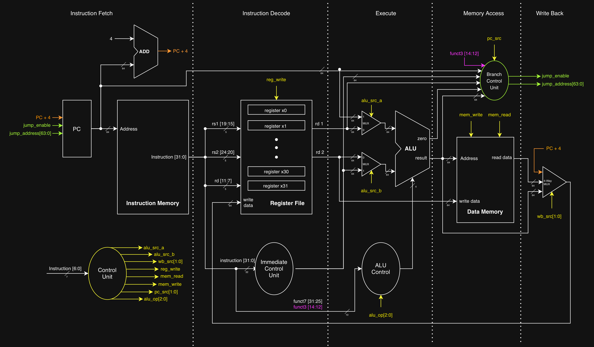

# CPU Architecture Spec

Creating this document as the main reference for the CPU implementation, this should outline the supported instructions, expected behavior, and control signals. This should be the source of truth from which the C & RTL are derived.

> *note: since the RTL will be the final hardware implementation, there's a slight chance this spec may become outdated.

## 0. CPU Datapath (single cycle)

---

## 1. Architectural State

High level expected CPU state is inspired by RISC-V. It's based on the [RV32I base instruction set](http://five-embeddev.com/riscv-user-isa-manual/Priv-v1.12/instr-table.html) + expanded to 64-bit on the registers' size.

- 32 × 64-bit general purpose registers (`x0` hardwired to 0)
- 64-bit program counter (`pc`)
- Main memory (byte-addressed, look at soc_spec for memory details)

---

## 2. Execution Model

Single-cycle execution:

1. Instruction Fetch
3. Instruction Decode
4. Execute
5. Memory Access
6. Write Back

---

## 3. Supported Instructions

list of instructions

- R-type
- I-type

---

## 4. ALU Spec

| ALU Opcode | Behavior | Used By |
|:----------:|----------|---------|
| `ALU_OP_ADD` | `result = a + b` | `add`, `addi`, `lw`, `sw`, `jalr`, `auipc` |
| `ALU_OP_SUB` | `result = a - b` | `sub`, `beq`, `bne` |
| `ALU_OP_AND` | `result = a & b` | `and`, `andi` |
| `ALU_OP_OR` | `result = a \| b` | `or`, `ori` |
| `ALU_OP_XOR` | `result = a ^ b` | `xor`, `xori` |
| `ALU_OP_SLL` | `result = a << (b & 0x3F)` | `sll`, `slli` |
| `ALU_OP_SRL` | `result = a >> (b & 0x3F)` (logical) | `srl`, `srli` |
| `ALU_OP_SRA` | `result = (int64_t)a >> (b & 0x3F)` | `sra`, `srai` |
| `ALU_OP_SLT` | `result = ((int64_t)a < (int64_t)b) ? 1 : 0` | `slt`, `slti`, `blt`, `bge` |
| `ALU_OP_SLTU` | `result = (a < b) ? 1 : 0` | `sltu`, `sltiu`, `bltu`, `bgeu` |
| `ALU_OP_PASS_B` | `result = b` | `lui` |

---

## 5. Control Signals

These control signals

- `alu_src_a`: selects data for ALU_A input.
- `alu_src_b`: selects data for ALU_B input.
- `wb_src`: selects the component for a write back to register file.
    - `WB_ALU` = `00`
    - `WB_MEM` = `01`
    - `WB_PC4` = `10`
- `reg_write`: signals 'write' to the register file.
- `mem_read`: signals 'read' to RAM.
- `mem_write`: signals 'write' to RAM.
- `pc_src`: sets the program counter's `jump_enable` and `jump_address`.
    - `PC_NEXT` = `00`
    - `PC_BRANCH` = `01`
    - `PC_JAL` = `10`
    - `PC_JALR` = `11`
- `alu_op`: selects the ALU operation.

### 5.1 Control Unit

| Type | `alu_src_a` | `alu_src_b` | `wb_src` | `reg_write` | `mem_read` | `mem_write` | `pc_src` | `alu_op` |
|:-----|:------:|:--------:|:--------:|:-------:|:--------:|:------:|:-----:|:-------------:|
| R-type         | 0 | 0 | `00` | 1 | 0 | 0 | `00` | `001` |
| I-type         | 0 | 1 | `00` | 1 | 0 | 0 | `00` | `011` |
| S-type (LOAD)  | 0 | 1 | `01` | 1 | 1 | 0 | `00` | `000` |
| S-type (STORE) | 0 | 1 | `01` | 0 | 0 | 1 | `00` | `000` |
| B-type         | 0 | 0 | `00` | 0 | 0 | 0 | `01` | `010` |
| U-type (LUI)   | 1 | 1 | `00` | 1 | 0 | 0 | `00` | `100` |
| U-type (AUIPC) | 1 | 1 | `00` | 1 | 0 | 0 | `00` | `101` |
| J-type (JAL)   | 0 | 0 | `10` | 1 | 0 | 0 | `10` | `110` |
| J-type (JALR)  | 0 | 1 | `10` | 1 | 0 | 0 | `11` | `110` |
| SYSTEM         | 0 | 1 | `00` | 0 | 0 | 0 | `00` | `111` |

---

### 5.2 Immediate Control Unit

---

### 5.3 ALU Control Unit

| Type| alu_op | funct3 | ALU Opcode |
|:----|:------:|:------:|:-----------|
| ADD                     | `000` | `xxx` | `ALU_OP_ADD` |
| R-type (`sub`, `add`)   | `001` | `000` | (`funct7` == `0100000`) ? `ALU_OP_SUB` : `ALU_OP_ADD` |
| R-type (`sll`)          | `001` | `001` | `ALU_OP_SLL` |
| R-type (`slt`)          | `001` | `010` | `ALU_OP_SLT` |
| R-type (`sltu`)         | `001` | `011` | `ALU_OP_SLTU` |
| R-type (`xor`)          | `001` | `100` | `ALU_OP_XOR` |
| R-type (`sra`, `srl`)   | `001` | `101` | (`funct7` == `0100000`) ? `ALU_OP_SRA` : `ALU_OP_SRL` |
| R-type (`or`)           | `001` | `110` | `ALU_OP_OR` |
| R-type (`and`)          | `001` | `111` | `ALU_OP_AND` |
| B-type (`beq`, `bne`)   | `010` | `00X` | `ALU_OP_SUB` |
| B-type (`blt`, `bge`)   | `010` | `10X` | `ALU_OP_SLT` |
| B-type (`bltu`, `bgeu`) | `010` | `11X` | `ALU_OP_SLTU` |
| I-type (`addi`)         | `011` | `000` | `ALU_OP_ADD` |
| I-type (`slli`)         | `011` | `001` | `ALU_OP_SLL` |
| I-type (`slti`)         | `011` | `010` | `ALU_OP_SLT` |
| I-type (`sltui`)        | `011` | `011` | `ALU_OP_SLTU` |
| I-type (`xori`)         | `011` | `100` | `ALU_OP_XOR` |
| I-type (`srli`, `srai`) | `011` | `101` | (`funct7` == `0100000`) ? `ALU_OP_SRA` : `ALU_OP_SRL` |
| I-type (`ori`)          | `011` | `110` | `ALU_OP_OR` |
| I-type (`andi`)         | `011` | `111` | `ALU_OP_AND` |
| U-type (`lui`)          | `100` | `xxx` | `ALU_OP_PASS_B` |
| U-type (`auipc`)        | `101` | `xxx` | `ALU_OP_ADD` |
| J-type (`jal`, `jalr`)  | `110` | `xxx` | `ALU_OP_ADD` |
| SYSTEM (`ebreak`, `ecall`) | `111` | `xxx` | `ALU_OP_PASS_B` |

---

### 5.4 Branch Control Unit

---

### 5.5 PC Update

| Branch | Zero | Next PC |
|:------:|:----:|---------|
| 0 | X | PC + 4 |
| 1 | 0 | PC + 4 |
| 1 | 1 | Branch Target |

# Single-Cycle CPU Control Signals
